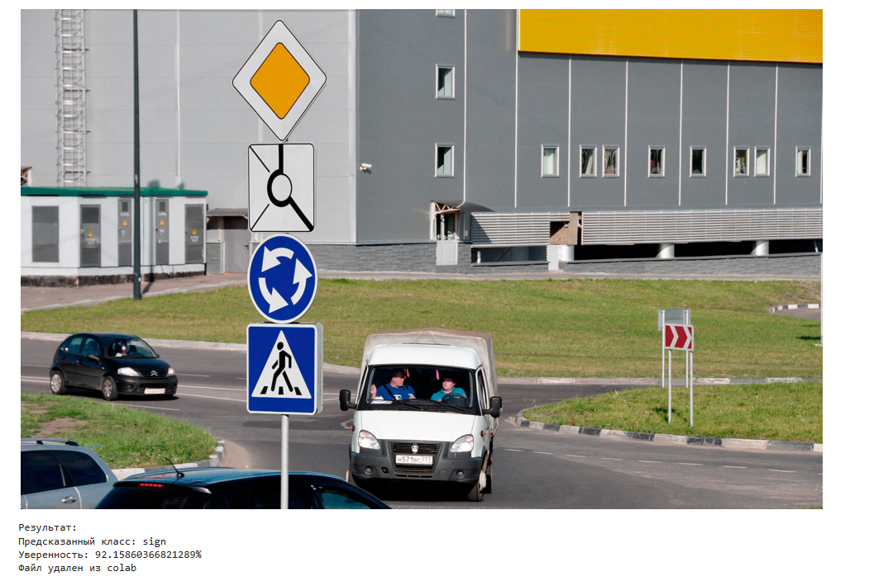
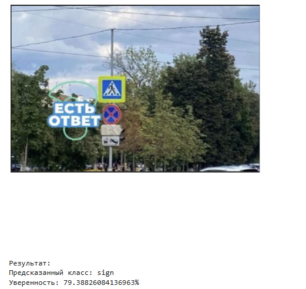

# Бинарная классификация изображений (знаки ПДД)

> Реализация: Google Colab (Jupyter Notebook), PyTorch, GPU (T4)

## Технологии

- Python, PyTorch, torchvision
- Google Colab (GPU T4)
- matplotlib, seaborn, scikit-learn, PIL
## О проекте

Нейросетевая модель бинарной классификации изображений, которая определяет,
есть ли на картинке дорожный знак. Решаемая задача — разделение изображений на два класса:

| Класс      | Описание                          |
|------------|-----------------------------------|
| `sign`     | На изображении присутствует дорожный знак |
| `not_sign` | Дорожного знака на изображении нет        |

## Примеры работы модели (Инференс)
Ниже приведены примеры результатов предсказания обученной модели для двух различных изображений не из выборки:

Пример с дорожным знаком:

- Истинный класс: sign
- Предсказание модели: sign
- Уверенность (Probability): 92.16%
  

Пример с шумом (посторонними элементами) на картинке:

- Истинный класс: sign
- Предсказание модели: sign
- Уверенность (Probability): 79.38%
  

## Что сделано

1. **Загрузка данных** — датасет подключён из Google Drive
   (`/content/drive/MyDrive/CNN_DATA`) и разбит на три выборки:
   - Train: **1903** изображения
   - Validation: **538** изображений
   - Test: **571** изображение

2. **Предобработка изображений** — изображения приводятся к размеру **224×224**,
   переводятся в тензоры и нормализуются по статистикам ImageNet
   (mean `[0.485, 0.456, 0.406]`, std `[0.229, 0.224, 0.225]`).

3. **Архитектура модели** — использован подход **transfer learning**:
   - Берётся предобученная на ImageNet модель **ResNet18**;
   - Полностью связный слой заменяется на `nn.Sequential`:
     Dropout(0.2) → Linear(512 → 2);
   - Модель обучается целиком (без заморозки признаковых слоёв).

4. **Обучение**:
   - Функция потерь — `CrossEntropyLoss`;
   - Оптимизатор — `Adam`, learning rate = 0.001;
   - Количество эпох — **10**;
   - Включён режим `cudnn.benchmark` для ускорения на GPU.

5. **Оценка качества**:
   - Отслеживание Loss и Accuracy на train/val по каждой эпохе;
   - Графики истории обучения;
   - `classification_report` и **матрица ошибок** (confusion matrix) на тестовой выборке.

6. **Инференс на пользовательском изображении**:
   - Функция, загружающая произвольную картинку в Colab;
   - Модель возвращает предсказанный класс и уверенность (probability).

## Результаты

### Обучение

| Метрика             | Значение          |
|---------------------|-------------------|
| Train Accuracy      | до ~99.6%         |
| Best Val Accuracy   | ~94.4% (эпоха 3)  |
| Val Accuracy (конец)| ~91.3% (эпоха 10) |

Train Loss при этом падает до ~0.01–0.06, что указывает на **сильный оверфиттинг**:
модель запоминает обучающую выборку, тогда как точность на валидации колеблется
(72–94% в разные эпохи).

### Тестовая выборка

| Метрика          | `not_sign` | `sign`   | Среднее |
|------------------|-----------|----------|---------|
| Precision        | 0.87       | 0.92      | 0.90    |
| Recall           | 0.86       | 0.92      | 0.90    |
| F1-score         | 0.87       | 0.92      | 0.90    |
| **Accuracy**     | —          | —         | **0.90** |

Итого итоговая accuracy на тесте: **~90%**.

### Примеры инференса

- Изображение дорожного знака → предсказание `sign`, уверенность ≈ 72.6%.

## Структура решения

- Монтируем Google Drive → загружаем датасет;
- Создаём `DataLoader` для train/val/test;
- Строим модель на базе ResNet18;
- Обучаем 10 эпох с логированием метрик;
- Строим графики, classification report и матрицу ошибок;
- Демонстрируем предсказание на пользовательском изображении.

## Как можно улучшить

### Аугментация данных
Сейчас используются только ресайз и нормализация. Добавление случайных
поворотов, сдвигов, отражений и изменения яркости повысит обобщающую способность
и снизит оверфиттинг.

### Регуляризация и обучение
- Добавить weight decay (L2) в оптимизатор;
- Использовать заморозку (freeze) предобученных слоёв и обучать только
  классификатор, либо применять gradual unfreezing;
- Добавить раннюю остановку (early stopping) по валидационной метрике;
- Подобрать learning rate (например, через scheduler или ReduceLROnPlateau);
- Уменьшить learning rate и/или увеличить число эпох.

### Повысить точность
- Попробовать более сильные архитектуры: ResNet50, EfficientNet, ViT;
- Использовать кросс-энтропию с label smoothing;
- Применять балансировку классов, если выборка несбалансированна.

### Улучшить оценку
- Сохранять лучшую модель по метрике валидации (best val checkpoint);
- Показывать ROC/PR-кривые и подбирать порог классификации;
- Увеличить test-set и сделать кросс-валидацию.

### Инференс
- Экспортировать модель в формат ONNX / TorchScript для переноса в продакшен;
- Предусмотреть обработку изображений с несколькими знаками (детекция).
